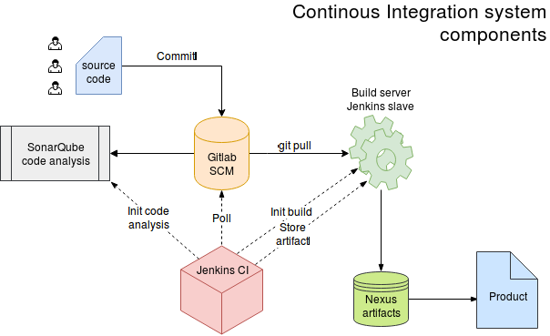

# README for agilis system

Overview of agilis system  

__Work in progress - docker files and ansible scripts are not public ready yet__

adamkov's ansible system provisioning playbooks for agilis system  
agilis is a hypothetical SW development environment based on docker containerized components

## Step by step deployment

1. Install Ubuntu server edition to target system and create account named user
2. Set up networking - static IP address template is available under files
3. Generate ssh keypair with generate-keys.sh script
4. ansible-playbook -K playbook.yml
5. ansible-playbook adamcustom.yml	(Optional)

## Acknowledgements

Jeff Geerling for docker installer role

